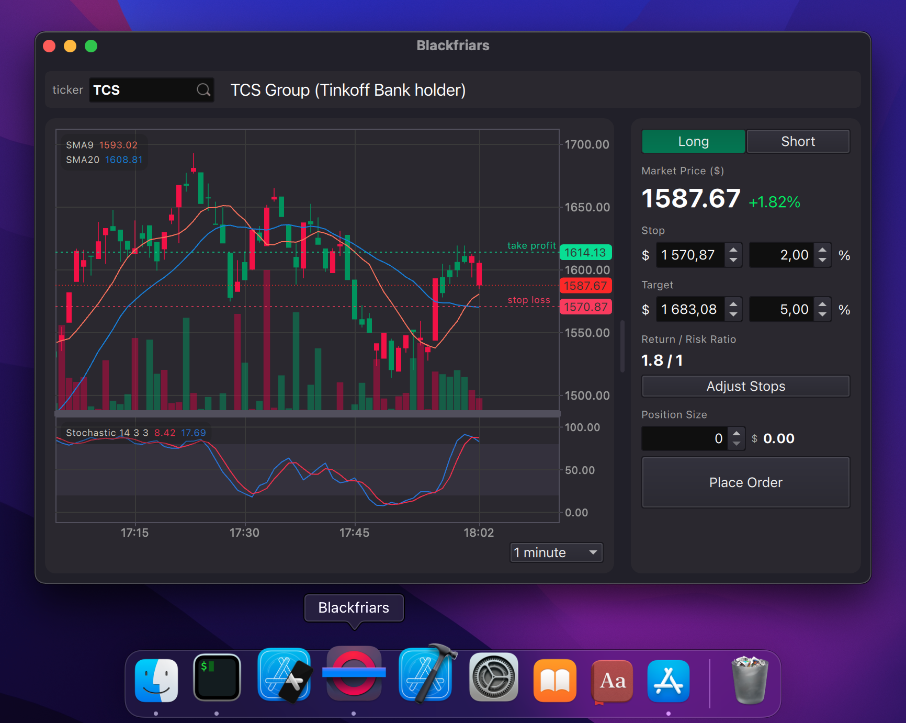

# Terminal (work in progress)

### An intraday trading terminal

The initial idea of the terminal is to do trades in Linux without using browsers or heavy Java clients. As QT is a cross-platform framework, the project can be built in Windows and MacOS as well.

## Goals

- UI and indicators relevant for intradayday trading.

- Versatile abstract interface for adding and implementing various Broker APIs.

- Tools for collecting and analysing trading performance over time.

- Triple screen trading (optionally).

### Current architecture

### At the moment

- Two implemented brokers:

#### Monte-Carlo
Random walk simulations sampled from a Gaussian distribution and an Exponential distribution to generate volume market data. Useful for debugging and development.

#### Tinkoff Investments sandbox
Which is able to request, using the REST API, available securities, only those traded in USD, into the autocompleter. Reads historical market data, within 1 day interval. Appends and updates new candles and order book entries via the WebSocket API.

- Essential functionality to navigate the chart and to adjust visually stops.

- *No order executions thus far*.

### Short-term TODOs

- Refactor all the code: penty of redundancies, everything is too draft-ish and cluttered.

- Add tests.

- Refine the control panel UI according to the workflow: ability to reverse positions, use leverage, etc.

> **Black Friar**.
> A Roman Catholic friar wearing the black mantle of the Dominican order.
